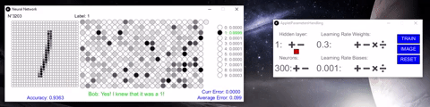
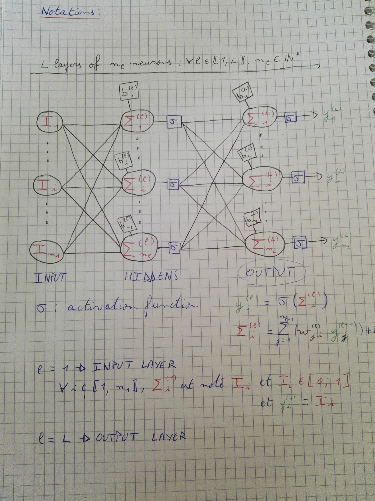
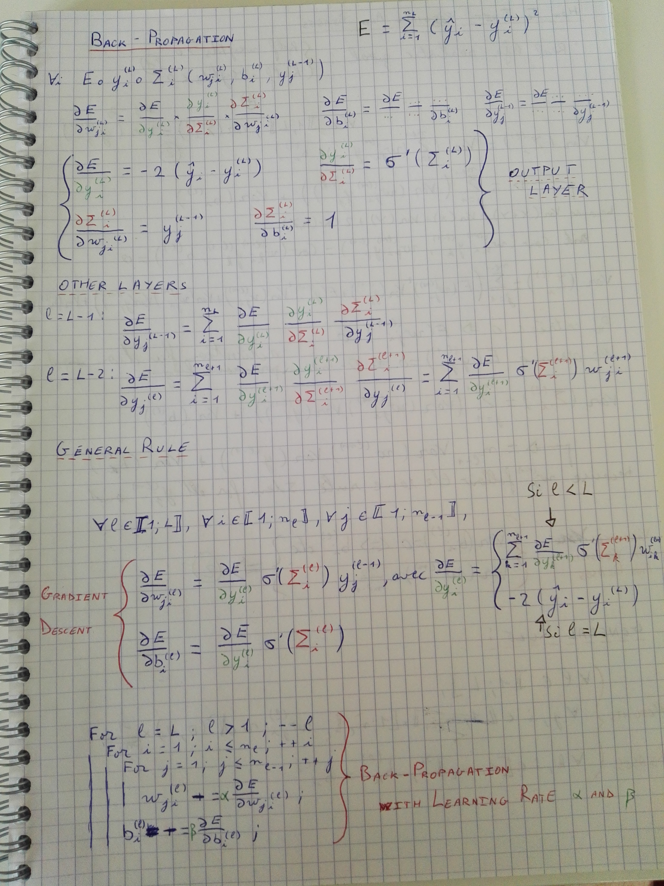
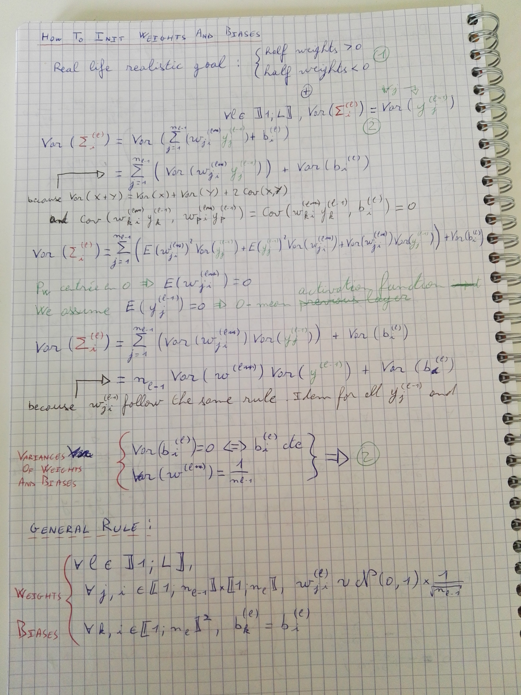

# Processing 3 - DeepFeedForward Neural Network: Digit recognition

Neural Network's *"Hello World"*: from scratch digit recognition with the MNIST database.

Hyper-parameter tuning done by hand with the developed interface.

### Formulas used

#### Notations

#### Back Propagation: Gradient Descent

#### Weights and Biases initialisation

